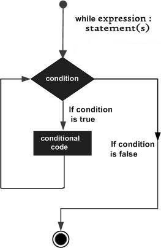

[Loop](loop.md) কী জিনিস সেটা আমরা এতক্ষনে শিখে ফেলেছি। এবার সময় এসেছে `while loop` কী জিনিস সেটা বুজার।

while loop কোন code block বা এক গুচ্ছ কোড কে বার বার পূনরাবৃত্তি করতে থাকে যতক্ষন কোন নির্দিষ্ট condition (শর্ত) সত্য থাকে বা `true` থাকে।

**Systex:**

```php
while( condition ){
    // This is loop body
    // code to be execute
}
```

নিচের programm টি লিখে run করে দেখুন,

```php
while(true){
  echo "bangla-php.com <br/>";
}
```
যেহেতু `while` এর condition সব সময় ই `true` তাই `while` এর ভিতরের কোড ব্লক `"bangla-php.com <br/>"` এটাই বার বার repeat হতে থাকবে।

এখন আমরা যদি চাই কোন নির্দিষ্ট সময়ে এই looping বন্ধ করতে , তাহলে আমাদের কে এমন কিছু করতে হবে যাতে `while` এর `condition` টি কোন এক সময় মিথ্যা হয়।

নিচের উদাহরনটি দেখুন,
```php
$x = 1;
while( $x < 10 ){
  echo $x."<br/>";
}
```

এই programm কে run করালেও দেখতে পাবেন $x এর পূর্বের value টা ই বার বার [echo](../echo_print.md) হচ্ছে। এখানে শর্ত দেয়া হয়েছে `$x < 10`। যেহেতু `$x` এর মান কোন পরিবর্তন হচ্ছে না তাই `$x < 10` এই শর্ত সব সময়ই `true`। তাই এখানে $x এর value 1 এটাই বার বার দেখাবে।

এই সমস্যা সমাধান কীভাবে করা যায়?

চিন্তা করে দেখুন। আমরা যদি প্রতিবার লুপ চলাকালিন সময়েই $x এর মান বৃদ্ধি করতে পারি তবে এক সময় $x এর মান এক সময় 10 এর এর চেয়ে বড় হয়ে যাবে এবং while এর condition ও false হয়ে যাবে এবং ঠিক তখনই লুপ টি থেমে যাবে।

নিচের programm টি দেখুন,
```php
$x = 1;
while( $x < 10 ){
  echo $x."<br/>";
  $x++;
}
```
**ফলাফল:**
> 
1<br/>2<br/>3<br/>4<br/>5<br/>6<br/>7<br/>8<br/>9<br/>

প্রথমে $x এর value ছিল 1 , শর্ত হচ্ছে `$x < 10` তা এই ক্ষেতে সত্য তাই প্রথম loop execution এ $x এর value 1 print হয় এবং [Increment operator](../operators/increment_decrement_operators.md) `++` এর মাধ্যমে `$x` এর মান এক বৃদ্ধি পেয়ে হয়ে যায় `2`। 
এই ভাবে $x এর মান এক এক করে বৃদ্ধি পেতে থাকে এবং প্রতিবার updated value দেখাতে থাকবে। 

এইভাবে ৯ম loop execution এ $x এর মান 9 হয় এবং একই সাথে $x এর মান বৃদ্ধি পেয়ে 10 হয়।

`১০ম` বার লুপ execution হওয়ার সময় `$x < 10` শর্ত টি মিথ্যা হয় কারন তখন $x এর value 10


যদি আরও ভালো করে বুজতে চান তবে নিচের ডায়াগ্রামটি মনযোগ দিয়ে দেখুন।


<div style="text-align:center;">

</div>

ছবিতে দেখানো হয়েছে PHP while loop এর ক্ষেত্রে একধুম শুরুতে condition টি check হয়। যদি condition টি true হয় তবে লুপ বডির কোড কে execute করে এবং পুনরায় condition check করে। এভাবে যতক্ষন condition সত্য থাকবে ততক্ষন লুপের ভেতরের সব কিছু পূনরাবৃত্তি হতে থাকবে। যখনই condition false হবে ঠিক তখনই লুপ থেকে বের হয়ে যাবে।

চলুন এবার একটু জটিল উদাহরন দেখা যাক,
এবার আমি while loop এর মাধ্যমে একটা টেবিল তৈরি করব।

```php
$brush_price = 5; 
$counter = 10;

echo "<table>";
echo "<tr><th>Quantity</th>";
echo "<th>Price</th></tr>";
while ( $counter <= 100 ) {
	echo "<tr><td>";
	echo $counter;
	echo "</td><td>";
	echo $brush_price * $counter;
	echo "</td></tr>";
	$counter = $counter + 10;
}
echo "</table>";
```

ফলাফল:

<table><tbody><tr><th>Quantity</th><th>Price</th></tr>
<tr><td>10</td><td>50</td></tr><tr><td>20</td><td>100</td>
</tr><tr><td>30</td><td>150</td></tr><tr><td>40</td><td>200</td></tr>
<tr><td>50</td><td>250</td></tr><tr><td>60</td><td>300</td></tr>
<tr><td>70</td><td>350</td></tr><tr><td>80</td><td>400</td></tr>
<tr><td>90</td><td>450</td></tr><tr><td>100</td><td>500</td></tr></tbody></table>