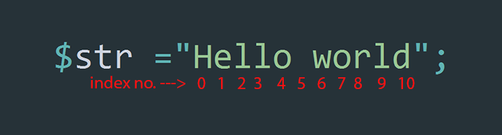

# strpos()
---
> একটা স্ট্রিংয়ের মধ্যে আরেকটা স্ট্রিং (সাবস্ট্রিং) এর পজিশন(index number) বের করতে strpos() ফাংশন ব্যবহার হয়।

#### ফাংশন প্রোটোটাইপ:
```php
/**
 * The strpos() function finds the position of the first occurrence of a string inside another string.
 * @param  string  $haystack   [String to search]                       (Required)
 * @param  string  $needle     [Substring to find]                      (Required)
 * @param  int     $offset     [Index number for where to begin start]  (Optional)
 * @return [position of first occurance of substring in the string]
 */
int strpos( $haystack , $needle, $offset = 0);
```

#### প্যারামিটার সমূহ:
| প্যারামিটার | ডাটা টাইপ | বর্ণনা |
| --- | :---: | --- |
|<span class="param-required">Required</span> $haystack | string | প্রধান স্ট্রিং যেটাতে আপনি অন্য স্ট্রিং(substring) টির অবস্থান বের করবেনবেন|
|<span class="param-required">Required</span> $needle| string | (সাবস্ট্রিং)যে স্ট্রিংটির পজিশন বের করতে চাচ্ছেন |
|<span class="param-optional">Optional</span> $offset| integer | স্ট্রিং এর যে ইন্ডেক্স সংখ্যা থেকে সাবস্ট্রিং খুজা শুরু করতে চান |


#### রিটার্ন ভেল্যু
২য় প্যারামিটারে দেয়া সাবস্ট্রিংটি , প্রথম প্যারামিটারে দেয়া স্ট্রিং এর মধ্যে একধুম প্রথমে যে ইন্ডেক্স এর সাথে মিলবে সেই ইন্ডেক্স নম্বরটি রিটার্ন করবে।

<hr>

strpos() ফাংশন এর প্রথম দুটি প্যারামিটার হচ্ছে Required. প্রথম প্যারামিটারে একটি স্ট্রিং যাবে যেটা নিয়ে আমরা কাজ করতে চাই। ২য় প্যারামিটারে যাবে সাবস্ট্রিং অর্থাৎ প্রধান স্ট্রিং এর মাঝে আমরা যে স্ট্রিং এর পজিশন আমারা বের করতে চাই।

নিচের চিত্রে `Hello world` স্ট্রিংটির character গুলির ইন্ডেক্স নম্বর দেখানো হল।




#### উদাহরন ১:

```php
$str ="Hello world";

echo strpos($str, "w");
```


> **ফলাফল:** <br/>
6

<a href="http://code.runnable.com/VtQ-gwq7Bs5tHotv/strpos-example-1-for-php" target="_blank" class="try-it"><i class="fa fa-play"></i>&nbsp;&nbsp;যাচাই করে দেখুন</a><br/>

ফলাফলে `7` পাওয়া গেছে কারন `w` এই স্ট্রিংটি `Hello world` এর 7 নম্বত ইনডেক্স এ আছে।


#### উদাহরন ২:
```php
$str ="Hello world";

echo strpos($str, "ld");
```


> **ফলাফল:** <br/>
9

<a href="http://code.runnable.com/VtQ_iQA5UhBuhfIz/strpos-example-2-for-php" target="_blank" class="try-it"><i class="fa fa-play"></i>&nbsp;&nbsp;যাচাই করে দেখুন</a>

`ld` এই স্ট্রিংটি `Hello world` এর 9 নম্বত ইনডেক্স এ আছে।


#### উদাহরন ৩:
```php
$str ="Hello world";

echo strpos($str, "o",5);
```

> **ফলাফল:** <br/>
7

<a href="http://code.runnable.com/VtRAUZi3Fshthru7/strpos-example-3-for-php" target="_blank" class="try-it"><i class="fa fa-play"></i>&nbsp;&nbsp;যাচাই করে দেখুন</a>

খেয়াল করুন আমি ৩য় প্যারামিটারে 5 দিয়েছি যার কারনে `Hello world` স্ট্রিং এর ৫ম character index এর পর থেকে খুজা শুরু হয়েছে। অর্থাৎ এখন `Hello world` স্ট্রিংটি হয়ে যাবে ` world`(একটি ফাকা স্পেস সহ)। এখন `Hello world` স্ট্রিংটির character index position 5 থেকে 10 এর মাঝে `o` স্ট্রিংটি পাওয়া গেছে 7 নম্বর ইন্ডেক্সে , তাই রিটার্ন পাওয়া গেছে `7`।


#### আরও জানতে দেখতে পারেন:
* [PHP Menual](http://php.net/manual/en/function.strpos.php)
* [W3schools](http://www.w3schools.com/php/func_string_strpos.asp)
* [Tutorial Point](http://www.tutorialspoint.com/php/php_function_strpos.htm)