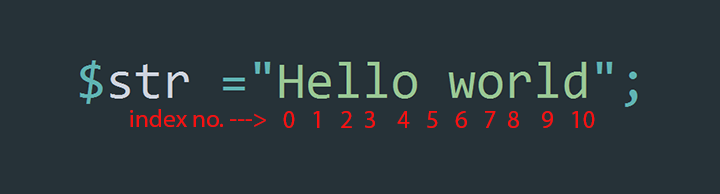

# substr()
---

> index number ব্যবহার করে কোন স্ট্রিং এর নির্দিষ্ট অংশ বের করে আনার জন্য ব্যবহার করা হয় `substr()` ফাংশন।

### ফাংশন প্রোটোটাইপ: 
```php
/**
 * substr — Return part of a string
 * @param string  $string  [The input string. Must be one character or longer.](Required)
 * @param int     $start   [Index number for where to start return](Required)
 * @param int     $length  [define $string length]
 * @return string [Returns the extracted part of string; or FALSE on failure, or an empty string.]
 */
string substr ( string $string , int $start [, int $length ] );
```

### প্যারামিটার সমুহ:

| প্যারামিটার | ডাটা টাইপ | বর্ণনা |
| --- | :---: | --- |
| <span class="param-required">Required</span> $string | String | প্রধান স্ট্রিং |
| <span class="param-required">Required</span> $start | int | প্রধান স্ট্রিং এর যে index নম্বর এর পর থেকে ফিরে পেত চান |
|<span class="param-optional">Optional</span> $length | int | প্রধান স্ট্রিং এর দৈর্ঘ্য |

### রিটার্ন ভেল্যু:
* `$start` এ ভেল্যু দেয়া হবে `$string` ভেরিইয়েবল এর স্ট্রিং এর সেই index position থেকে শুরু করে পরের অংশ রিটার্ন করবে।
* `$length` এ যে ভেল্যু দেয়া হবে `$string` এর দৈর্ঘ্য তত বলে বিবেচিত হবে।


<br />
<br />
নিচের ছবিটি লক্ষ করুন। এটাতে `Hello world` স্ট্রিং এর প্রতিটি character এর index নম্বর দেখানো হয়েছে।
<br />
<br />



এবার উদাহরন গুলি দেখুন।

#### উদাহরন ১:
```php
$str = "Hello world";
echo substr($str,3);
```

> **ফলাফল:**<br>
>  lo world

<a href="http://code.runnable.com/VtUGOGy3yG0MC15V/substr-example-1-for-php" target="_blank" class="try-it"><i class="fa fa-play"></i>&nbsp;&nbsp;যাচাই করে দেখুন</a>

`$str` ভেরিয়েবল এর স্ট্রিং এর index নম্বর `3` থেকে শুরু করে এর পরের অংশ রিটার্ন হয়েছে।


#### উদাহরন ২:
```php
$str = "Hello world";
echo substr($str,1);
```

> **ফলাফল:**<br>
>  ello world

<a href="http://code.runnable.com/VtUIbmy3yG0MC16H/substr-example-2-for-php" target="_blank" class="try-it"><i class="fa fa-play"></i>&nbsp;&nbsp;যাচাই করে দেখুন</a>

`$str` ভেরিয়েবল এর স্ট্রিং এর index নম্বর `1` থেকে শুরু করে এর পরের অংশ রিটার্ন হয়েছে।


#### উদাহরন ৩:
```php
$str = "Hello world";
echo substr($str,2,7);
```

> **ফলাফল:**<br>
>  llo wor

<a href="http://code.runnable.com/VtUJjxYyShENAZ9p/substr-example-3-for-php" target="_blank" class="try-it"><i class="fa fa-play"></i>&nbsp;&nbsp;যাচাই করে দেখুন</a>

`Hello world` এই স্ট্রিং এ মোট `11` টি অক্ষর(character) আছে। `$length` এ `7` দেয়ায় স্ট্রিংটির দৈর্ঘ্য হয়ে যাবে `7` এবং এখন স্ট্রিংটি হয়ে যাবে এরকম > `Hello wor`

আশা করি আপনি বুজেই ফেলেছেন যে এই উদাহরনে `Hello wor` স্ট্রিং এর index `2` থেকে শুরু করে পরের অংশ রিটার্ন হয়েছে।   

 
#### উদাহরন ৪:
```php
$str = "Hello world";
echo substr($str,10)."<br>";
echo substr($str,1)."<br>";
echo substr($str,3)."<br>";
echo substr($str,7)."<br>";
```

> **ফলাফল:**<br>
> d<br/>
> ello world<br/>
> lo world<br/>
> orld<br/>

<a href="http://code.runnable.com/VtUNcBYyShENAZ_2/substr-example-4-for-php" target="_blank" class="try-it"><i class="fa fa-play"></i>&nbsp;&nbsp;যাচাই করে দেখুন</a>

`Hello world` স্ট্রিং এর index নম্বর যথাক্রমে `10` , `1` , `3` , `7` এর পর থেকে রিটার্ন হয়েছে।


# $start এবং $length এ nagative ভেল্যু

> ###### লক্ষনীয় যে ...
>  ---
* $start এ যদি nagative ভেল্যু দেয়া হয় তাহলে nagative ভেল্যু যত হবে , প্রদানকৃত স্ট্রিং($string প্যারামিটার) শেষের দিক থেকে তত গুলি অক্ষর(character) রিটার্ন হবে।
* $length এ যত nagative ভেল্যু দিবেন প্রদানকৃত স্ট্রিং($string প্যারামিটার) এর শেষের দিক থেকে ততগুলি অক্ষর বাদ যাবে।


নিচের উদাহরন গুলি মনোযোগ দিয়ে দেখুন।


#### উদাহরন ৫:
```php
$str = "Hello world";
echo substr($str,-1)."<br>";
echo substr($str,-10)."<br>";
echo substr($str,-8)."<br>";
echo substr($str,-4)."<br>";
```

> **ফলাফল:**<br>
d<br>
ello world<br>
lo world<br>
orld<br>

<a href="http://code.runnable.com/VtUTo6PazDQOMnu0/substr-example-5-for-php" target="_blank" class="try-it"><i class="fa fa-play"></i>&nbsp;&nbsp;যাচাই করে দেখুন</a>

`Hello world` স্ট্রিং এর শেষের দিক থেকে যথাক্রমে `1` , `10` , `8` এবং `4` টি character রিটার্ন হয়েছে।


#### উদাহরন ৬:
```php
$str = "Hello world";
echo substr($str,0,-3)."<br>";
echo substr($str,0,-2)."<br>";
echo substr($str,0,-7)."<br>";

```

> **ফলাফল:**<br>
Hello wo<br>
Hello wor<br>
Hell<br>

<a href="http://code.runnable.com/VtUVQjHOsuMO4EQ2/substr-example-6-for-php" target="_blank" class="try-it"><i class="fa fa-play"></i>&nbsp;&nbsp;যাচাই করে দেখুন</a>

`Hello world` স্ট্রিং এর শেষের দিক থেকে যথাক্রমে `3` , `2` , এবং `7` টি character বাদ গিয়েছে।


